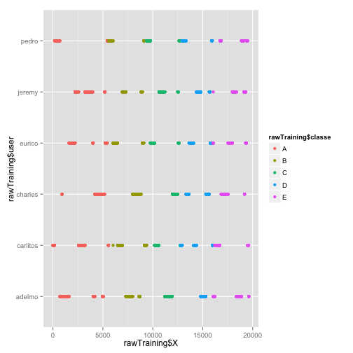
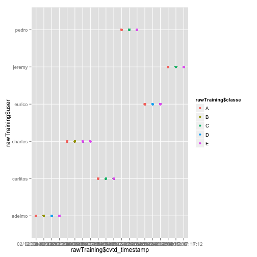
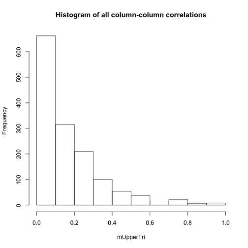
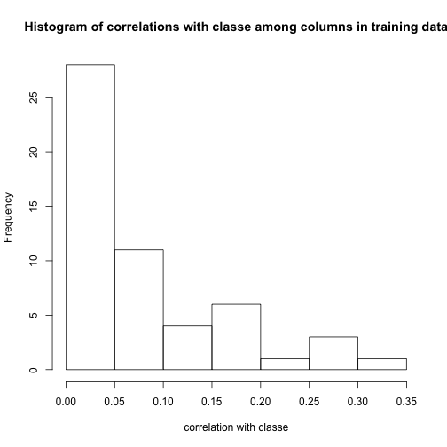
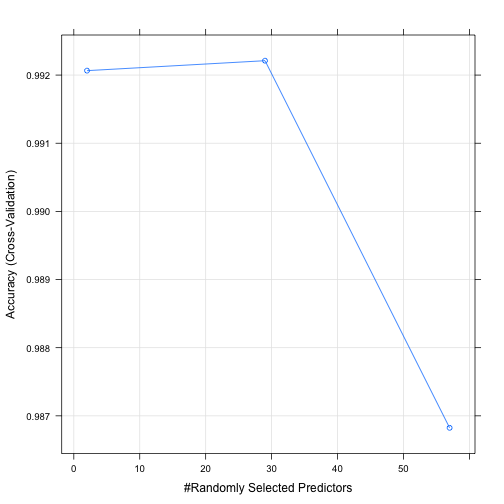

Predicting Activity-Quality Class in the Ugulino, Velloso, and Fuks Weightlifting Human Activity Recognition Dataset
===


(Context: this report is part of an assignment for the June 2014 section of [Coursera](http://coursera.com)'s "[Practical Machine Learning](https://www.coursera.org/course/predmachlearn)" class. I will assume readers are familiar with the assignment.)

### The Data

The data to be predicted are described at [http://groupware.les.inf.puc-rio.br/har#weight_lifting_exercises][]. Key facts: there are six participants, and each participant performed 10 repetitions of the bicep curl in each of five fashions: correctly, or incorrectly in one of four ways (by throwing out the hip, etc). The activity-quality classes are coded in the `classe` column as A, B, C, D, or E, and `classe` is what we want to predict.

According to the associated [paper][] the data in the provided dataset are sensor readings recorded at 45Hz by inertial measurement units located at the users' glove, armband, lumbar belt, and on the dumbbell itself. The IMU measures 3 degrees of freedom each from its accelerometer, gyroscope, and magnetometer. This amounts to 36 raw variables recorded 45 times a second during the activity.

Additionally, further statistical and signal processing was done by the research group. Inferring from the column names of the data and the wording in the paper, it appears that roll, pitch, and yaw were calculated at each of the four sensor locations by integrating over sliding windows of the raw intertial data (adding 12 derived variables to the 36 raw variables), and then 8 statistical summaries (maximum, variance, skewness, etc) of the roll, pitch, and yaw were computed over windows of the data, adding 8 x 3 x 4 = 96 variables to the 48 described previously.

### Examination of the Data

Inspecting the column names of the training data, I infer that first few columns have various kinds of "bookkeeping data", and the remaining columns (until the last column, `classe`) have sensor-derived data.


```r
data <- read.csv("data/pml-training.csv", na.strings = c("NA", ""))
names(data)[1:10]
```

```
##  [1] "X"                    "user_name"            "raw_timestamp_part_1"
##  [4] "raw_timestamp_part_2" "cvtd_timestamp"       "new_window"          
##  [7] "num_window"           "roll_belt"            "pitch_belt"          
## [10] "yaw_belt"
```

```r
names(data)[length(names(data)) - 4:0]
```

```
## [1] "accel_forearm_z"  "magnet_forearm_x" "magnet_forearm_y"
## [4] "magnet_forearm_z" "classe"
```


Before examining the contents of these columns, I set aside a test set so my exploratory analysis is not biased by "unauthorized" peeks at the training data. (I used the same seed from the very beginning of the analysis.)


```r
# set seed so test/train split remains same.
set.seed(62412)

inTrain <- createDataPartition(y = data$classe, p = 0.7, list = FALSE)
rawTraining <- data[inTrain, ]
rawTesting <- data[-inTrain, ]
```


First, note that 100 of the columns consist almost entirely of `NA`s:


```r
fractionNA <- sapply(rawTraining, function(col) {
    sum(is.na(col))/length(col)
})
table(round(fractionNA, digits = 2))
```

```
## 
##    0 0.98 
##   60  100
```


What seems to be happening is that the statistical-summary columns are calculated over nonoverlapping windows, and the corresponding columns are left blank except at the end of a window. Because we need to be able to predict the activity class given readings from a single point in time, I remove (or, begin the process of removing) these columns:


```r
keep <- fractionNA < 0.1
```


Looking at the "bookeeping" columns, I note that the `X` and various `timestamp` related columns have a rather _straightfoward_ relationship to the `classe`:


```r
qplot(rawTraining$X, rawTraining$user, color = rawTraining$classe)
```

 

```r
qplot(rawTraining$cvtd_timestamp, rawTraining$user, color = rawTraining$classe, 
    )
```

 


It's obvious what's happening here: `X` is a sample sequence number and `*_timestamp` are, well, timestamps, and we're seeing the process of recording the training data. (Adelmo did some correct reps, then some Class B, D, and E reps, then it was Charles' turn, etc.)

Likewise, the problem is obvious: if we learn on this data, we will be unable to generalize the results. In fact a good learning algorithm (for some value of "good") should learn to throw out every variable except `X` and/or the timestamps. But these variables are _completely_ useless for predicting Adelmo's weightlifting form in a different session.

So I throw these columns away. (And `num_window`, which has the same problem) Furthermore, `new_window` is just a marker of the begining of each of the ~50-sample-long windows.


```r
keep[["X"]] <- FALSE
keep[grep("timestamp", names(keep))] <- FALSE
keep[["num_window"]] <- FALSE
keep[["new_window"]] <- FALSE
```


I do keep `user_name`; in activity-recognition of this kind (_e.g._, in voice recognition) , it is usually necessary to train a model for _specific users_; generalization to users the system hasn't seen before is hard (this is also mentioned in the paper).

Finally, I define a function that can apply the identical column-cleaning process to the testing set.


```r
prep <- function(data) {
    data <- data[, keep]
    # cast any 'integer' columns to 'numeric' because read.csv treats soem
    # columns as numeric in pml-training.csv but integer in pml-testing.csv
    data <- data.frame(lapply(data, function(col) {
        if (class(col) == "integer") {
            col <- as.numeric(col)
        }
        col
    }))
    data
}

training <- prep(rawTraining)
```


With candidate columns chosen, I take a look at correlations in the data, looking for highly correlated columns:


```r
# correlation matrix
m <- abs(cor(sapply(training, unclass)))
# remove correlation with self
diag(m) <- 0
# count pairs only once by getting upper triangular part
mUpperTri <- m[upper.tri(m)]
hist(mUpperTri, main = "Histogram of all column-column correlations")
```

 


Only about 1% of column pairs have correlation > 0.8:


```r
sum(mUpperTri > 0.8)/length(mUpperTri)
```

```
## [1] 0.01048
```


And no single column is particulary well-correlated with classe (note the x-axis range):


```r
hist(data.frame(m)$classe, xlab = "correlation with classe", main = "Histogram of correlations with classe among columns in training data")
```

 


Because I will use random forest (discussion below), I will stop the exploration of the data here. Random forests do not require much data cleaning.

### Selection of performance measure

We have a 5-category categorization task. If the classes are balanced, then simple accuracy (# correct predictions / # total predictions) is a reasonable choice for measuring model performance. Indeed, the frequency of the various outcomes are reasonably balanced, so we will use accuracy:


```r
table(training$classe)
```

```
## 
##    A    B    C    D    E 
## 3906 2658 2396 2252 2525
```


### Prediction

I will use the `caret` implementation of random forests to make predictions. This is because random forests are known to be a good "first resort", providing very good results with very little tuning or data preparation, and because I know the original authors used random forests.

While random forests produce a "black box", it is helpful to know that they can be used to estimate variable importance and "prototypes" (variable values that are most characteristic of a particular outcome). I have also seen it suggested to use flexible, but "black box" techniques such as random forests first, in order to get a sense of the likely upper bound of the prediction performance, then to attempt prediction with possibly less-flexible but more-interpretable models.

#### Cross-validation and model building

I use the `caret` package's `train` function to automatically perform parameter tuning on the random forest. In order to use cross-validation (to get honest estimates of the out-of-sample error during the model building process, before proceeding to final validation), I merely pass the appropriate `method` argument to the `trainControl` function. The one tunable parameter for random forests is the `mtry` parameter which specifies how many variables to keep for each tree (each tree is built on a randomly chosen subset of features of length `mtry`).

(It's worth noting that random forests have an additional technique for estimating the out-of-sample error rate, the [out of bag][] estimate, which has the nice property of being automatically generated during training. I used oob to select a model when classifying the 20 cases required to be submitted, before creating this writeup which uses cross-validation instead.)


```r
trainRf <- function(training) {
    # use cross-validation
    trControl = trainControl(method = "cv", number = 10)
    # time our results (4 cores)
    time <- system.time(fit <- train(classe ~ ., data = training, method = "rf", 
        trControl = trControl))
    list(time = time, fit = fit)
}

trainResults <- trainRf(training)
trainResults$time
```

```
##    user  system elapsed 
##  1420.3    12.8   549.0
```


The resulting `fit` object can be plotted, to show us how `train` varied the parameter:


```r
plot(trainResults$fit)
```

 


We can also find the estimated out-of-sample accuracy, according to the cross-validation, for the finally-selected value of `mtry`:


```r
with(trainResults$fit, results$Accuracy[results$mtry == bestTune$mtry[1]])
```

```
## [1] 0.9922
```


### Results and out-of-sample error estimate

Finally, in order to estimate the out-of-sample error of the final model fit, I use the trained model to predict outcomes for the held-out testing (validation) set. `caret`'s `confusionMatrix` compares the predicted values to the known values.


```r
validate <- function(fit, testing) {
    predictions <- predict(fit, newdata = testing)
    confmat <- confusionMatrix(data = predictions, reference = testing$classe)
    list(predictions = predictions, confmat = confmat)
}

# when applying doPrediction to testing data, remember to prep:
testing <- prep(rawTesting)
validationResults <- validate(trainResults$fit, testing)
```


The resulting confusion matrix is:


```r
validationResults$confmat$table
```

```
##           Reference
## Prediction    A    B    C    D    E
##          A 1672    6    0    0    0
##          B    1 1133    7    0    1
##          C    0    0 1009   12    1
##          D    0    0   10  950    2
##          E    1    0    0    2 1078
```


The accuracy on the testing set--which is my estimate of 1 - (the out-of-sample-error)--can be read from the confusion matrix object:


```r
validationResults$confmat$overall[["Accuracy"]]
```

```
## [1] 0.9927
```


So the expected out-of-sample error is ``0.7`` %.


[http://groupware.les.inf.puc-rio.br/har#weight_lifting_exercises]: http://groupware.les.inf.puc-rio.br/har#weight_lifting_exercises
[paper]: http://groupware.les.inf.puc-rio.br/work.jsf?p1=11201
[out of bag]: http://www.stat.berkeley.edu/~breiman/RandomForests/cc_home.htm#oober
